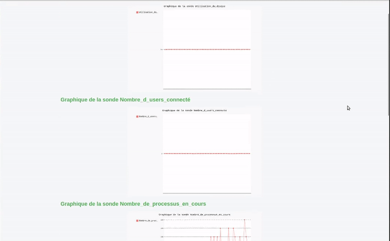

# Monitoring Sondes - Setup & Utilisation

## Sommaire
- [📁 Permissions](#📁-permissions)
- [✉️ Configuration des mails](#✉️-configuration-des-mails)
- [🛠️ Mise en route](#🛠️-mise-en-route)
- [🚨 Lancement des outils](#🚨-lancement-des-outils)
- [✅ Remarques](#✅-remarques)
- [Structure du projet](#structure-du-projet)
- [Licence](#licence)

## 📁 Permissions

Donner les droits nécessaires au dossier `sondes/` pour permettre aux sondes de fonctionner :

```bash
chmod -R 755 sondes/
```

Donner les droits d'exécution aux fichiers suivants :

```bash
chmod +x cert.py clean.py collect.py graph.py web.py
```

S'assurer que les fichiers suivants sont lisibles :

```bash
chmod 644 cronlog.log template.txt monitoring.db
```

Donner les droits d'accès à `graphique_sonde.html` dans `ams/static/` :

```bash
chmod 644 ams/static/graphique_sonde.html
```

## ✉️ Configuration des mails

Changer le mot de passe SMTP dans le cron :

- Modifier la ligne correspondante au script `collect.py` dans la crontab pour y mettre votre vrai `smtp_password`.

Changer les adresses mails dans `collect.py` :

- Ouvrir `collect.py` et modifier la liste des destinataires :

```python
destinataires = ["votre_mail@example.com"]
```

Vérifier que le port SMTP utilisé est correct selon votre fournisseur (souvent `587` ou `465`).

## 🛠️ Mise en route

Nettoyer la base de données :

```bash
python3 clean.py
```

Attendre 5 minutes pour que le cron commence à insérer des données dans la base.

**(Optionnel)** Repartir de zéro :

```bash
rm monitoring.db
python3 clean.py
```

Attendre que la base se remplisse un peu.

## 🚨 Lancement des outils

Lancer `cert.py` pour tester l’alerte :

```bash
python3 cert.py
```

Lancer `graph.py` pour générer les graphiques et créer la page HTML :

```bash
python3 graph.py
```

Lancer `web.py` pour servir les graphiques localement :

```bash
python3 web.py
```

Accès aux graphiques via : [http://127.0.0.1:8080](http://127.0.0.1:8080)

## ✅ Remarques

- Vérifier que le cron est bien configuré pour lancer `collect.py` toutes les 5 minutes ou selon votre intervalle souhaité.
- Tous les fichiers doivent être à leur bonne place (notamment `graphique_sonde.html` dans `ams/static/`).
- Vérifier le fichier `cronlog.log` en cas de souci.

[](#)


